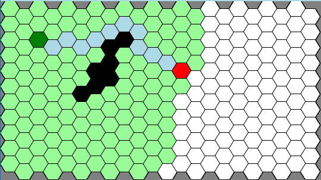

# Hexagonal-Path-Finding-Visualiser

Watch how different path finding algorithms find solutions on a hexagonal grid.

Available
[here](https://rory-sullivan.github.io/Hexagonal-Path-Finding-Visualiser/).

## The basics

Select a starting point, an ending point and optionally draw some walls that
the algorithm will need to go around. Pick an algorithm and watch how it solves
the maze. Nodes that are being considered by the algorithm light up and once a
path is found it is displayed on the screen.

