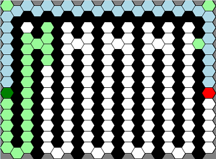
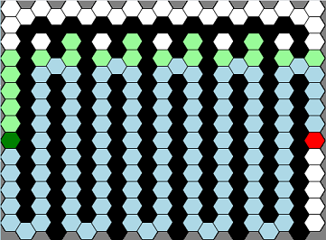

# Hexagonal-Path-Finding-Visualiser

Watch and learn how different path finding algorithms search for solutions on a
hexagonal grid. Available
[here](https://rory-sullivan.github.io/Hexagonal-Path-Finding-Visualiser/).

This project was inspired by similar projects I came across on Github,
particularly
[this one](https://github.com/clementmihailescu/Pathfinding-Visualizer). However
I was interested in what these would look like on a hexagonal grid. Hexagonal
grids are interesting because the distance between the centres of adjacent tiles
is always equal (unlike square grids where the diagonal neighbours are further
away). Hex grids are often used in games.

## The Basics

Select a starting point, an ending point and optionally draw some walls that the
algorithm will need to go around. Pick an algorithm and watch how it solves the
maze. Nodes that are being considered by the algorithm light up and once a path
is found it is displayed on the screen.

## The Problem

The idea here is, given a starting point and an ending point, to find the
shortest distance between the two points without going through any walls. Every
hexagon on our grid is assumed to be separated from its neighbours by a distance
of one.

## Algorithms

I have implemented three different algorithms in this project.
[Dijkstra](https://en.wikipedia.org/wiki/Dijkstra%27s_algorithm),
[A\*](https://en.wikipedia.org/wiki/A*_search_algorithm) and a modified version
of A\*.

The Dijkstra algorithm searches through paths always starting with the path
which is the closest to the starting point until we arrive at the end point. It
guarantees finding the shortest path.

In this case Dijkstra's algorithm is not dissimilar to a
[breadth first search](https://en.wikipedia.org/wiki/Breadth-first_search) since
all of our grid points are an equal distance from their neighbours. To truly see
the performance benefits of the Dijkstra algorithm over a breadth first search
we would need to weight the paths between certain tiles. Imagine putting a hill
in the middle of our grid. However I think this is outside of the scope of this
project and so I have not included this functionality.

The A\* algorithm is similar to Dijkstra's algorithm but instead of using the
length of the path to determine which path to consider next we estimate the
distance of the path. This is done by adding the current length of the path to
an estimate of how far the path is from the end. We estimate this distance by
looking at how many squares we would need to go through to get to the end if
there were no walls. This is done using a metric similar to the
[taxicab distance](https://en.wikipedia.org/wiki/Taxicab_geometry) but for
hexagonal grids. With this metric, A\* guarantees finding the shortest path.

For my modified version of the A\* algorithm I use the same distance metric as
above but multiply it by a bias. This bias means that paths which get closer to
the end point are disproportionately favoured to other paths. The metric is no
longer ["admissible"](https://en.wikipedia.org/wiki/Admissible_heuristic) which
means that the algorithm no longer guarantees finding the shortest path however
it is able to outperform the other two algorithms in a lot of situations. More
on this in the analysis section.

All algorithms will find a path if one exists.

## Mazes

I included three mazes which you can auto generate onto the grid. A maze of
vertical lines, a maze of horizontal lines and a radial maze. After generating a
maze you can alter it to your liking, adding or deleting paths. Note that the
radial maze does not contain a path automatically, you will have to make one
after it is generated.

| Vertical Maze                               | Horizontal Maze                                 | Radial Maze                             |
| ------------------------------------------- | ----------------------------------------------- | --------------------------------------- |
|  |  |  |

## Analysis of algorithms

In general, A* will out perform Dijkstra and the biased A* will out perform A*.
This is particularly noticeable when the grid is largely open with few walls,
see the images below. This is due to the fact that there are a lot of possible
paths and so Dijkstra spends a lot of time exploring sub optimal paths whereas
the A* algorithms have an idea of which direction to head and thus move more
directly to the goal.

| Dijkstra                                         | A\*                                     | Biased A\*                                           |
| ------------------------------------------------ | --------------------------------------- | ---------------------------------------------------- |
|  |  |  |

In these diagrams the green tiles show the search space of the algorithm while
the blue tiles show the optimal path found by the algorithm. In general, the
larger the search space of an algorithm the less efficient it is. We can see
that all algorithms find the optimal path and that the search space of A* is
much smaller than Dijkstra and the biased A* is smaller again.

It is worth noting that the algorithms are slowed down drastically for the
purposes of the animation in this project. The grid sizes here are sufficiently
small that any of these algorithms could solve the problem in a fraction of a
second. Also on much larger grids the efficiency of the algorithm is determined
by more than just its search space, we would also need to consider how we are
searching for the path of least distance as well as space efficiency.

In more restricted grids with fewer possible paths the performance difference
between the algorithms is less noticeable however this is when we may see the
biased A\* algorithm picking a less than optimal path. Consider the images
below.

| A\*                                               | Biased A\*                                                    |
| ------------------------------------------------- | ------------------------------------------------------------- |
|  |  |

Concluding from the above the best algorithm to use depends on the situation. If
you have a largely open grid or finding a solution quickly is more important
than finding the shortest path then the biased A* algorithm is most likely the
best option, whereas if you are in a more restricted grid or finding the
shortest path is imperative then A* is probably the way to go.
